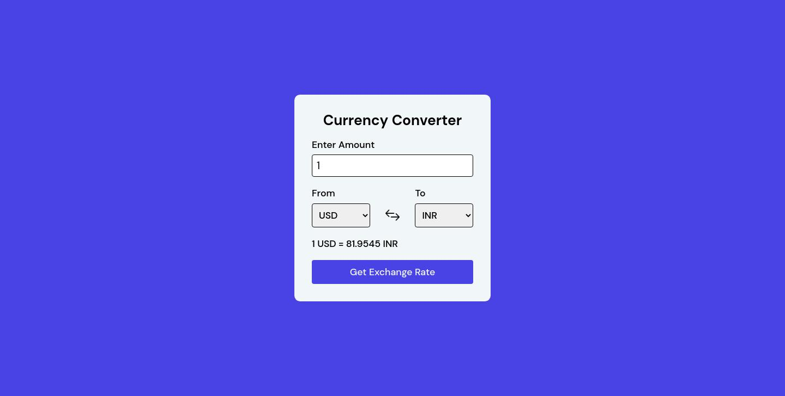

# ADVICE GENERATOR

## Welcome! 👋

This web ui is done using HTML, CSS and JS. In this project you will learn how to use fetch api and how to create dynamic elements in Javascript.
API that is used in this project is taken from https://www.exchangerate-api.com/
## Tech Stack

**Client:** HTML, CSS, JS

## Deployment

Deploy this project on Github Pages / Vercel / Netlify.

**Live URL:** https://priyanshusharma0326.github.io/currency-conversion-app/
